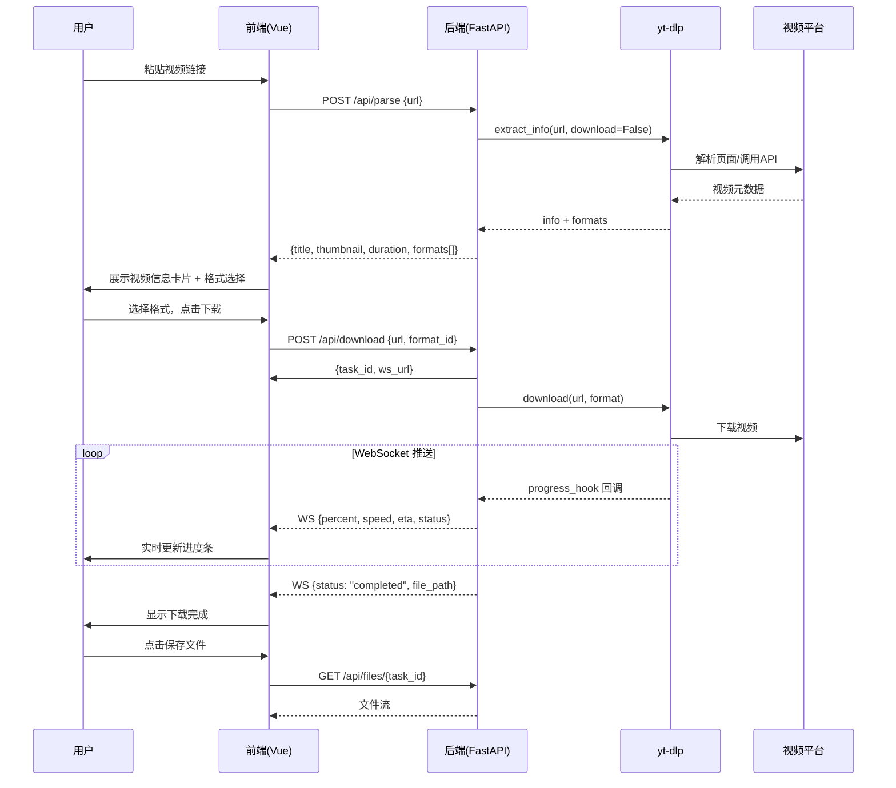

# 方案设计文档

## 1. 技术选型

| 层次 | 技术 | 选型理由 |
|------|------|----------|
| 前端框架 | Vue 3 + Vite | 轻量、快速、生态成熟 |
| CSS 框架 | Tailwind CSS 4 | 原子化 CSS，快速构建 UI |
| 后端框架 | FastAPI (Python) | 异步支持好、自动生成 API 文档、WebSocket 原生支持 |
| 视频引擎 | yt-dlp | GitHub 19w+ Star，支持 1800+ 平台，Python 库直接调用 |
| 进度推送 | WebSocket | 实时双向通信，低延迟 |
| 进程管理 | Uvicorn | 高性能 ASGI 服务器 |

## 2. 系统架构

```
┌──────────────────────────────────────────────────┐
│                    浏览器                          │
│  ┌────────────────────────────────────────────┐  │
│  │         Vue 3 + Vite + Tailwind CSS         │  │
│  │  NavBar / Hero / UrlInput / VideoInfo       │  │
│  │  FormatSelector / DownloadProgress / History│  │
│  │              useDownloader.js               │  │
│  └──────────────┬─────────────────────────────┘  │
│                 │  HTTP / WebSocket                │
└─────────────────┼──────────────────────────────────┘
                  │
┌─────────────────┼──────────────────────────────────┐
│                 ▼                                   │
│  ┌────────────────────────────────────────────┐  │
│  │            FastAPI (Python)                  │  │
│  │  /api/parse  /api/download  /api/health     │  │
│  │  /ws/download/{task_id}  /api/files/{id}    │  │
│  └──────────────┬─────────────────────────────┘  │
│                 │                                   │
│  ┌──────────────▼─────────────────────────────┐  │
│  │   VideoDownloader (core/downloader.py)      │  │
│  │   parse_info()    download()                │  │
│  │   progress_hook → asyncio.Queue → WS        │  │
│  └──────────────┬─────────────────────────────┘  │
│                 │                                   │
│  ┌──────────────▼─────────────────────────────┐  │
│  │         yt-dlp (Python Library)              │  │
│  │         extract_info / download              │  │
│  └──────────────┬─────────────────────────────┘  │
└─────────────────┼──────────────────────────────────┘
                  │
┌─────────────────▼──────────────────────────────────┐
│              视频平台 (YouTube / B站 / ...)          │
└─────────────────────────────────────────────────────┘
```

## 3. 核心流程



## 4. API 设计

### 4.1 REST 接口

| 方法 | 路径 | 说明 | 请求体 | 响应 |
|------|------|------|--------|------|
| GET | `/api/health` | 健康检查 | - | `{"status": "ok"}` |
| POST | `/api/parse` | 解析视频链接 | `{"url": "..."}` | VideoInfo |
| POST | `/api/download` | 创建下载任务 | `{"url": "...", "format_id": "best"}` | `{"task_id": "...", "ws_url": "..."}` |
| GET | `/api/files/{task_id}` | 下载文件 | - | 文件流 |
| GET | `/api/downloads` | 已完成任务列表 | - | `{"downloads": [...]}` |

### 4.2 WebSocket

| 路径 | 说明 |
|------|------|
| `WS /ws/download/{task_id}` | 实时下载进度推送 |

WebSocket 消息格式：

```json
{
  "status": "downloading",
  "percent": 45.2,
  "speed": "2.1 MB/s",
  "eta": 30,
  "downloaded": 52428800,
  "total": 115343360
}
```

状态枚举：`pending` → `downloading` → `processing` → `completed` / `failed`

### 4.3 数据模型

**VideoInfo**：视频元数据
- title, webpage_url, duration, thumbnail, description, uploader, view_count, extractor, formats[]

**FormatOption**：格式选项
- format_id, ext, resolution, height, fps, vcodec, acodec, filesize, is_audio_only, is_video_only, is_combined

**ProgressData**：进度数据
- status, percent, speed, eta, downloaded, total, file_path, error

## 5. 前端组件树

```
App.vue
├── NavBar.vue                 # 顶部导航（Logo + 导航菜单 + 登录/立即使用按钮）
├── HeroSection.vue            # Hero 区域（大标题 + 副标题 + 输入框 + 解析按钮 + 平台图标）
├── results section (内联)     # 解析结果区域（仅在有结果或错误时显示）
│   ├── video-card             # 视频信息卡片（封面/标题/时长/平台 + 格式选择 + 下载按钮 + 进度条）
│   └── history-card           # 下载历史列表
└── FeaturesSection.vue        # 特性展示区（4 个特性卡片，一行排列）
```

**设计说明：**
- 输入框和解析按钮内嵌在 `HeroSection.vue` 中，通过 props 传入 `url`、`loading` 状态和事件回调
- 视频信息、格式选择、下载进度、下载历史均在 `App.vue` 的 results section 中内联实现，不拆分为独立组件
- `FeaturesSection.vue` 为纯展示组件，无状态

## 6. 关键技术决策

| 决策 | 方案 | 原因 |
|------|------|------|
| yt-dlp 集成方式 | Python 库 `import yt_dlp` | 类型安全、无子进程开销、进度回调直接 |
| 进度推送 | `progress_hook` → `asyncio.Queue` → WebSocket | 延迟 < 100ms，天然异步 |
| 文件存储 | `{task_id}_{title}.{ext}` | 避免文件名冲突，可追溯 |
| 任务存储 | 内存 dict | 无数据库依赖，重启清空可接受 |
| 多线程 | 每任务独立 `YoutubeDL` 实例 | yt-dlp 非线程安全 |
| 前端代理 | Vite proxy → 后端 | 开发模式避免跨域 |
| 生产部署 | FastAPI 托管前端静态文件 | 单进程部署，零配置 |

## 7. 目录结构

```
free-video-downloader/
├── backend/
│   ├── main.py                 # FastAPI 入口
│   ├── requirements.txt        # Python 依赖
│   ├── core/
│   │   ├── downloader.py       # yt-dlp 封装
│   │   └── models.py           # Pydantic 数据模型
│   ├── api/
│   │   └── routes.py           # REST + WebSocket 路由
│   └── downloads/              # 下载文件输出
├── frontend/
│   ├── src/
│   │   ├── App.vue             # 主页面（含结果区内联逻辑）
│   │   ├── main.js             # Vue 入口
│   │   ├── style.css           # 全局样式（Tailwind + 基础重置）
│   │   ├── components/
│   │   │   ├── NavBar.vue          # 顶部导航栏（品牌 + 菜单 + 按钮）
│   │   │   ├── HeroSection.vue     # Hero 区域（含输入框和解析按钮）
│   │   │   ├── FeaturesSection.vue # 特性展示（4 卡片一行）
│   │   │   ├── UrlInput.vue        # 备用（当前未使用）
│   │   │   ├── VideoInfo.vue       # 备用（当前未使用）
│   │   │   ├── FormatSelector.vue  # 备用（当前未使用）
│   │   │   ├── DownloadProgress.vue # 备用（当前未使用）
│   │   │   └── DownloadHistory.vue  # 备用（当前未使用）
│   │   └── composables/
│   │       └── useDownloader.js    # API/WebSocket 对接（核心状态管理）
│   ├── vite.config.js          # Vite + Tailwind + 代理
│   └── index.html
├── docs/                       # 项目文档
├── image/                      # 设计参考图
├── start.bat                   # 一键启动脚本
└── README.md
```