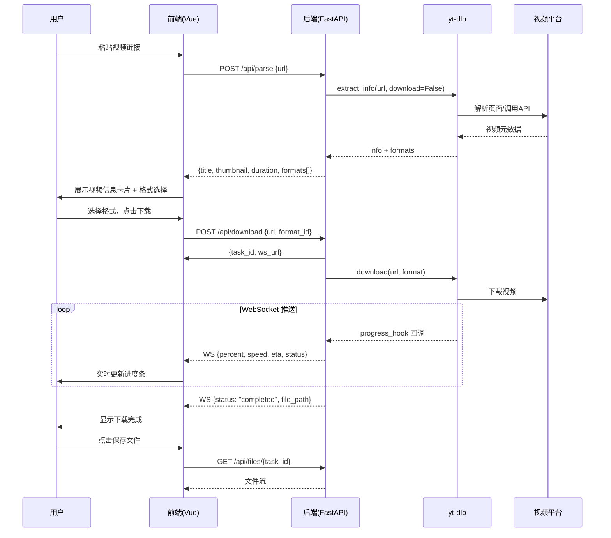

# 方案设计文档 — VideoMind

## 1. 技术选型

| 层次 | 技术 | 选型理由 |
|------|------|----------|
| 前端框架 | Vue 3 + Vite | 轻量、快速、生态成熟 |
| CSS 框架 | Tailwind CSS 4 | 原子化 CSS，快速构建 UI |
| 后端框架 | FastAPI (Python) | 异步支持好、自动生成 API 文档、WebSocket 原生支持 |
| 视频引擎 | yt-dlp | GitHub 19w+ Star，支持主流视频平台，Python 库直接调用 |
| AI 总结 | anthropic SDK + DeepSeek | 通过 Anthropic 兼容端点调用，支持流式 MessageStream（thinking + text 双轨） |
| 语音转录 | Faster-Whisper (small/int8) | 本地 CPU 推理，无字幕视频兜底方案，仅加载本地模型不联网 |
| 字幕校正 | AI 后处理 | Whisper 输出经 LLM 校正（利用视频标题/简介上下文修正专有名词、同音错字） |
| Markdown 渲染 | marked + DOMPurify | 轻量无依赖，XSS 防护，AI 输出结构化展示 |
| 思维导图 | markmap-lib + markmap-view | 将 Markdown 列表渲染为交互式思维导图 |
| 导图导出 | 原生 SVG + Canvas | SVG 走离屏重渲染与静态化导出，PNG 基于内联 SVG 生成 4K 位图，避免受展示区缩放影响 |
| 进度推送 | WebSocket / SSE | 下载用 WebSocket（双向），AI 总结用 SSE（单向流式） |
| 持久化 | SQLite | AI 结果缓存、Whisper 转录缓存、视频信息缓存，同 URL 不重复消耗资源；多P视频按 `?p=N` 隔离缓存 |
| 进程管理 | Uvicorn | 高性能 ASGI 服务器 |

## 2. 系统架构

```
┌──────────────────────────────────────────────────┐
│                    浏览器                          │
│  ┌────────────────────────────────────────────┐  │
│  │         Vue 3 + Vite + Tailwind CSS         │  │
│  │  NavBar / Hero / UrlInput / VideoInfo       │  │
│  │  FormatSelector / DownloadProgress / History│  │
│  │              useDownloader.js               │  │
│  └──────────────┬─────────────────────────────┘  │
│                 │  HTTP / WebSocket                │
└─────────────────┼──────────────────────────────────┘
                  │
┌─────────────────┼──────────────────────────────────┐
│                 ▼                                   │
│  ┌────────────────────────────────────────────┐  │
│  │            FastAPI (Python)                  │  │
│  │  /api/parse  /api/download  /api/health     │  │
│  │  /api/subtitle/text  /api/summarize          │  │
│  │  /api/summarize/stream  /api/chat/stream     │  │
│  │  /api/auth/*  (login/register/me/usage)      │  │
│  │  /ws/download/{task_id}  /api/files/{id}     │  │
│  └──────────────┬─────────────────────────────┘  │
│                 │                                   │
│  ┌──────────────▼─────────────────────────────┐  │
│  │   核心模块 (core/)                           │  │
│  │   downloader.py  ai_client.py  summarizer.py│  │
│  │   whisper.py  cache.py  models.py           │  │
│  └──────────────┬─────────────────────────────┘  │
│                 │                                   │
│  ┌──────────────▼─────────────────────────────┐  │
│  │         yt-dlp (Python Library)              │  │
│  │         extract_info / download              │  │
│  └──────────────┬─────────────────────────────┘  │
└─────────────────┼──────────────────────────────────┘
                  │
┌─────────────────▼──────────────────────────────────┐
│              视频平台 (YouTube / B站 / ...)          │
└─────────────────────────────────────────────────────┘
```

## 3. 核心流程

### 3.1 视频下载流程



### 3.2 字幕获取 Pipeline（四级降级）

```
┌─ Pipeline 1: 平台 API ─────────────────────────────┐
│  Bilibili CC 字幕 (api.bilibili.com/x/v2/dm/view)    │
│  → 人工字幕优先，自动字幕次之                          │
│  → 多P视频: 按分P的 cid 独立获取字幕                   │
│    extract_bilibili_subtitle_by_cid(bvid, cid, aid)   │
└──────────────────────────────────────────────────────┘
                    │ 无字幕
                    ▼
┌─ Pipeline 2: yt-dlp 原生字幕 ────────────────────────┐
│  info.subtitles + automatic_captions                  │
│  → 下载 SRT/VTT/JSON3 字幕文件                        │
│  → 过滤 danmaku 弹幕格式                              │
└──────────────────────────────────────────────────────┘
                    │ 无字幕
                    ▼
┌─ Pipeline 3: Whisper 语音转录 ───────────────────────┐
│  下载音频(mp3) → Faster-Whisper small (CPU/int8)      │
│  → AI 字幕校正 (利用标题/简介上下文)                   │
│  → 缓存到 whisper_cache 表                            │
│  ├─ 前置条件: is_model_available()                     │
│  ├─ 时长限制: duration ≤ WHISPER_MAX_DURATION (120s)   │
│  └─ 超时: 600s                                        │
└──────────────────────────────────────────────────────┘
                    │ 模型不可用/超时/超长
                    ▼
┌─ Pipeline 4: OCR 硬字幕（预留接口）──────────────────┐
└──────────────────────────────────────────────────────┘
```

**多P视频字幕获取**：B站多P视频的每个分P有独立的 cid（内容ID）。`_get_subtitle_text()` 检测 URL 中的 `?p=N` 参数，匹配对应分P的 cid，调用 `extract_bilibili_subtitle_by_cid()` 获取该P的字幕。无 `?p=N` 参数时使用默认的 `extract_bilibili_subtitle(url)`。

### 3.3 AI 总结流水线

```
URL → 查 ai_cache (命中→SSE重放)
    → 查 video_info_cache (超长视频→即时拒)
    → parse_info() → 字幕获取 pipeline
    → 有字幕:
        → 字幕>60000字符? 
          YES → 分片 → 首片优先（初步摘要流式~15s）→ 逐片进度 → 完整摘要流式覆盖
          NO  → AI摘要(流式)
        → 思维导图 → 学习笔记(流式) → 持久化
    → 无字幕: 基于视频简介降级总结 / 返回400
```

### 3.4 视频在线播放 + AI 联动

```
┌─ 播放流程 ──────────────────────────────────────────────────┐
│  parse_info() 时从 yt-dlp formats 提取 stream_url            │
│  → 合并流优先（vcodec+acodec），DASH 降级到纯视频流           │
│  → stream_expires_at = now + 1800s                           │
│  → 前端封面图点击 → VideoPlayerModal → /api/video/stream 代理  │
│  → 播放失败 → /api/video/refresh 轻量级刷新 → 重新播放        │
└──────────────────────────────────────────────────────────────┘

┌─ 字幕联动 ──────────────────────────────────────────────────┐
│  /api/subtitle/text 返回 segments[{start, end, text}]        │
│  → Bilibili CC: API 直接返回 segments                        │
│  → yt-dlp SRT/VTT/JSON3: extract_subtitle_segments() 解析    │
│  → Whisper: 无 segments（纯文本无时间戳）                     │
│  → segments 持久化到 DB，缓存命中时一并返回                   │
│  → 前端: 字幕时间戳可点击 → seekTo(seconds)                   │
│  → 前端: currentVideoTime → isActiveSegment → 高亮+自动滚动   │
└──────────────────────────────────────────────────────────────┘

┌─ 笔记联动 ──────────────────────────────────────────────────┐
│  AI 笔记生成后 → inject_notes_timestamps(notes, subtitle)     │
│  → 解析 section 标题 + 正文，匹配字幕段落（LCS+bigram）       │
│  → 标题末尾注入 [MM:SS]                                      │
│  → 前端 renderNotesMarkdown() 替换为可点击 <span>             │
│  → 事件委托 click → onSeekVideo(seconds)                      │
└──────────────────────────────────────────────────────────────┘
```

## 4. API 设计

### 4.1 REST 接口

| 方法 | 路径 | 说明 | 请求体 | 响应 |
|------|------|------|--------|------|
| GET | `/api/health` | 健康检查 | - | `{"status": "ok"}` |
| POST | `/api/parse` | 解析视频链接 | `{"url": "..."}` | VideoInfo |
| GET | `/api/thumbnail` | 缩略图代理 | `?url=...` | 图片二进制流 |
| GET | `/api/subtitle` | 下载字幕文件 | `?url=...&lang=...&auto=false` | SRT/VTT 字幕文件 |
| GET | `/api/subtitle/translate` | 翻译字幕 | `?url=...&lang=...&target=zh-Hans` | 翻译后的字幕文件 |
| GET | `/api/subtitle/text` | 字幕文本提取 | `?url=...&lang=zh` | `{"text": "...", "lang": "zh", "segments": [...], ...}` |
| GET | `/api/video/stream` | 视频流代理 | `?url=...` | 视频二进制流（支持 Range 请求） |
| GET | `/api/video/refresh` | 刷新过期视频直链 | `?url=...` | `{"stream_url": "...", "stream_expires_at": ...}` |
| POST | `/api/summarize` | AI 视频总结（同步） | `{"url": "..."}` | SummaryResult |
| POST | `/api/summarize/stream` | AI 视频总结（SSE 流式） | `{"url": "...", "lang": "zh"}` | SSE 事件流 |
| POST | `/api/chat/stream` | AI 问答（SSE 流式） | `{"subtitle_text": "...", "question": "...", "history": []}` | SSE 事件流 |
| POST | `/api/download` | 创建下载任务 | `{"url": "...", "format_id": "best"}` | `{"task_id": "...", "ws_url": "..."}` |
| GET | `/api/files/{task_id}` | 下载文件 | - | 文件流 |
| GET | `/api/downloads` | 已完成任务列表 | - | `{"downloads": [...]}` |
| GET | `/api/history` | 学习历史列表 | `?q=...&tag=...&platform=...&sort=newest&limit=50&offset=0` | `{"items": [...], "total": N}` |
| POST | `/api/history/{url_hash}/favorite` | 切换收藏状态 | - | `{"is_favorite": true/false}` |
| DELETE | `/api/history/{url_hash}` | 删除学习记录 | - | `{"ok": true}` |
| GET | `/api/history/stats` | 学习统计数据 | - | `{"total_videos": N, "total_notes_chars": N, ...}` |
| GET | `/api/history/tags` | 所有标签（含使用次数） | - | `[{"name": "...", "count": N}, ...]` |
| GET | `/api/search` | 跨视频语义搜索 | `?q=...&limit=10` | `{"results": [...], "query": "..."}` |
| POST | `/api/auth/register` | 用户注册 | `{"username": "...", "password": "..."}` | `{"status": "ok"}` + Set-Cookie |
| POST | `/api/auth/login` | 用户登录 | `{"username": "...", "password": "..."}` | `{"status": "ok"}` + Set-Cookie |
| POST | `/api/auth/logout` | 退出登录 | - | `{"status": "ok"}` + 清除 Cookie |
| GET | `/api/auth/me` | 当前用户信息 | - | `{"logged_in": true/false, "user": {...}, "usage": {...}}` |
| GET | `/api/auth/usage` | 轻量用量查询 | - | `{"used": N, "limit": N, "allowed": true/false}` |
| POST | `/api/auth/guest-sign` | 游客设备签名 | `{"device_id": "..."}` | `{"signature": "..."}` |

### 4.2 实时通信

**WebSocket** — 下载进度推送

| 路径 | 说明 |
|------|------|
| `WS /ws/download/{task_id}` | 实时下载进度推送 |

WebSocket 消息格式：

```json
{
  "status": "downloading",
  "percent": 45.2,
  "speed": "2.1 MB/s",
  "eta": 30,
  "downloaded": 52428800,
  "total": 115343360
}
```

**SSE（Server-Sent Events）** — AI 总结/问答实时流式输出

SSE 端点返回 `text/event-stream`，事件格式：

```json
data: {"type": "progress", "data": {"stage": "subtitle_loaded", ...}}

data: {"type": "thinking_start", "data": {}}

data: {"type": "thinking", "data": {"text": "..."}}

data: {"type": "text", "data": {"text": "..."}}

data: {"type": "result", "data": {"summary": "...", "chapters": [...], "mindmap": {...}}}

data: {"type": "mindmap", "data": {"markdown": "..."}}

data: {"type": "notes_text", "data": {"text": "..."}}

data: {"type": "done", "data": {}}
```

事件类型：

| 事件 | 说明 |
|------|------|
| `progress` | 进度通知。stage: `subtitle_loaded` / `summary_initial` / `chunk_progress` / `summary_final` / `summary_generating` / `mindmap_generating` / `notes_generating` 等 |
| `cache_hit` | 命中 AI 缓存，直接重放 |
| `thinking_start` / `thinking` / `thinking_end` | 思考模型推理过程 |
| `text_start` / `text` | AI 摘要流式文本生成 |
| `notes_text` | 学习笔记流式文本生成（逐 token） |
| `flashcard_text` | 学习卡片流式文本生成（逐 token） |
| `mindmap` | 思维导图 Markdown（一次性） |
| `result` | 最终结构化结果。长视频首次为初步摘要（`is_partial: true`），第二次为完整摘要（`is_partial: false`） |
| `warn` | 警告信息（无字幕降级、Whisper 跳过等） |
| `error` | 错误信息 |
| `done` | 流结束 |

**长视频两阶段摘要（Chunk Summary 首片优先）**：字幕 >60000 字符时触发分片。`stream_chunk_summaries()` 首片用详细提示词（200-300 字+核心概念），后续片精简（100-150 字）。首片完成后立即流式输出初步摘要，用户约 15s 即可阅读内容；全部片完成后输出完整摘要覆盖。思维导图和笔记复用合并后的摘要文本，总计 N+4 次 API 调用（vs 旧版 3N+3 次）。

实现原理：`_sse_generator` 使用 `asyncio.Queue` + `loop.call_soon_threadsafe` 实现真正的实时流式传输，每生成一个 token 即推送至客户端，不再缓冲。

状态枚举：`pending` → `downloading` → `processing` → `completed` / `failed`

客户端发送下载指令格式：

```json
{
  "url": "https://www.bilibili.com/video/BVxxx",
  "format_id": "bestvideo+bestaudio/best",
  "concat_parts": true,
  "selected_parts": [1, 2, 3]
}
```

`concat_parts: true` 触发分P合并下载；`selected_parts` 为空时下载全部分P。

### 4.3 数据库表

| 表名 | 说明 | 关键字段 |
|------|------|----------|
| `videos` | 视频元数据 | id, url, title, platform, status |
| `subtitles` | 字幕文本 | video_id, source, language, full_text, segments_json |
| `ai_outputs` | AI 输出结果 | video_id, output_type, content |
| `tags` / `video_tags` | 标签关联 | tag_id, video_id |
| `users` | 用户账号 | username, password_hash, role, daily_limit, is_active |
| `sessions` | 登录会话 | id(UUID), user_id, expires_at |
| `usage_logs` | AI 使用记录 | user_id, guest_id, action, status, created_at |
| `user_history` | 学习历史 | user_id, guest_id, url_hash, is_favorite |
| `ai_cache` | AI 结果缓存 | url_hash(PK), result_json, video_title |
| `whisper_cache` | Whisper 转录缓存 | url_hash(PK), subtitle_text, raw_text |
| `video_info_cache` | 视频信息缓存 | url_hash(PK), duration, info_json |

### 4.4 数据模型

**ParseRequest**：解析请求
- url（视频链接）

**VideoInfo**：视频元数据
- title, webpage_url, duration, thumbnail, description, uploader, view_count, extractor, formats[], parts[], chapters[]
- stream_url（视频流直链，parse 时提取，30 分钟过期）, stream_expires_at（过期时间戳）

**FormatOption**：格式选项
- format_id, ext, resolution, height, fps, vcodec, acodec, filesize, is_audio_only, is_video_only, is_combined

**SubtitleTrack**：字幕轨道
- lang（语言代码）, name（显示名称）, ext（格式后缀）, is_auto（是否自动生成）

**VideoPart**：分P条目（仅 B 站多P视频）
- index（P序号）, title（分P标题）, cid（分P内容ID，用于按P获取字幕）, duration, filesize（估算字节数）, filesize_str

**DownloadRequest**：下载请求
- url, format_id, concat_parts（是否合并分P）, selected_parts（选中的分P索引列表）

**DownloadTask**：下载任务
- task_id, url, format_id, status, ws_url, file_path, title, created_at

**ProgressData**：进度数据
- status, percent, speed, eta, downloaded, total, file_path, error

**SummarizeRequest**：AI 总结请求
- url（视频链接）, lang（字幕语言偏好，默认 `zh`）
- 系统自动选择字幕源：B站CC > yt-dlp原生 > Whisper转录 > OCR预留
- 视频时长超过 `WHISPER_MAX_DURATION`（默认 120s）直接跳过 Whisper

**SummaryResult**：AI 总结结果
- summary（摘要文本）, chapters[]（章节大纲：time/title/content）, mindmap（思维导图：title/children）

**ChatMessage**：对话消息
- role（`user` / `assistant`）, content（消息内容）

**ChatRequest**：AI 问答请求
- subtitle_text（字幕纯文本）, question（用户问题）, history[]（历史对话记录）

**AuthRequest**：认证请求
- username（用户名，≥2 字符）, password（密码，≥4 字符）

**GuestSignRequest**：游客签名请求
- device_id（设备标识，≥8 字符）

**用户权限矩阵**：

| 角色 | AI 使用限制 | 学习历史 | 标签/统计 | 典型场景 |
|------|------------|----------|-----------|----------|
| Guest | 3 次/天 | 无 | 无 | 未注册用户体验 |
| User | 20 次/天 | 个人历史 | 个人数据 | 注册用户 |
| Admin | 无限制 | 全局历史 | 全局数据 | 管理员 |

> AI 总结使用 `anthropic` SDK 调用 DeepSeek 的 Anthropic 兼容端点（`https://api.deepseek.com/anthropic`），而非 OpenAI 兼容端点。

## 5. 前端组件树

```
App.vue（~1900 行，视图路由：home / history）
├── NavBar.vue                 # 顶部导航（毛玻璃效果，Logo + 学习历史按钮 + 用户菜单 + 登录按钮）
│   └── LoginModal.vue         # 登录注册弹窗（深色主题，登录/注册切换，用户名+密码表单）
├── HistoryPage.vue            # 学习历史页（独立组件，自行管理状态，emit('select-item') 通知 App 跳转）
│   ├── 统计仪表盘             # 学习视频数、笔记字数、平均时长、覆盖平台
│   ├── 搜索栏                 # 文本搜索 + AI 语义搜索切换 + 排序/平台筛选
│   ├── 标签过滤栏             # 标签列表（点击筛选）
│   ├── 语义搜索结果            # ChromaDB 向量搜索结果卡片
│   └── 历史卡片列表            # 分页加载、收藏、删除、多P展开/折叠
├── HeroSection.vue            # Hero 区域（深色背景 + 光晕 + 标题 + 输入框 + 下载按钮 + 平台标签流，移动端纵向堆叠）
├── results section (内联)     # 解析结果区域（仅在有结果或错误时显示）
│   ├── error-card             # 错误提示（红色半透明背景）
│   ├── video-card             # 视频信息卡片
│   │   ├── video-info         # 封面图（含播放图标叠加层+时长角标）+ 标题 + 元数据标签行 + 原视频链接
│   │   ├── tab-bar            # 标签栏（下载 / AI 总结）
│   │   ├── [下载标签页]
│   │   │   ├── parts-section      # 分P选择器（B站多P视频，checkbox+序号+标题+时长）
│   │   │   ├── format-section     # 格式选择（2列等宽网格，视频/音频合并展示）
│   │   │   ├── subtitle-section   # 字幕区（手动/自动分组，下载+翻译按钮）
│   │   │   ├── download-button    # 下载按钮（蓝青渐变，全宽）
│   │   │   └── progress-card      # 下载进度（shimmer动画，状态图标+边框变色）
│   │   └── [AI 总结标签页]
│   │       └── AiSummary.vue      # AI 总结组件（内含：分P选择器 + 字幕加载状态 + 流式摘要 + 章节大纲 + 思维导图 + 学习笔记 + AI 问答，Markdown 渲染，移动端 Tab/内容区自适应）
│   └── history-card           # 下载记录（状态图标+标题+时间戳+保存按钮）
├── FeaturesSection.vue        # 特性展示区（6 个卡片，3 列排列，含 2 个 Pro 卡片）
└── FooterSection.vue          # 页脚（品牌 + 链接 + 平台列表 + 版权）
```

**设计说明：**
- 整体采用深色主题（`#0F172A`），CSS 变量统一管理颜色
- 输入框和解析按钮内嵌在 `HeroSection.vue` 中，通过 props 传入 `url`、`loading` 状态和事件回调
- `HistoryPage.vue` 为独立组件，包含所有学习历史相关的 JS/模板/CSS（scoped），通过 `currentView` 视图切换控制显示
- 视频信息、格式选择、下载进度在 `App.vue` 的 results section 中内联实现
- `FeaturesSection.vue` 为纯展示组件，含 4 个基础功能卡片 + 2 个 Pro 专属卡片
- `FooterSection.vue` 为纯展示组件，包含产品/支持/法律链接和平台列表
- 平台展示以国内为主（B站、抖音、小红书），海外平台为辅（YouTube、TikTok、Instagram 等）
- 辅助函数：`formatViewCount()`（播放量万为单位）、`formatDuration()`（秒转 mm:ss）、`formatTime()`（时间戳格式化）
- 下载历史数据通过 `useDownloader.js` 管理，每条记录包含 `task_id`、`title`、`status`、`time` 字段

## 6. 关键技术决策

| 决策 | 方案 | 原因 |
|------|------|------|
| yt-dlp 集成方式 | Python 库 `import yt_dlp` | 类型安全、无子进程开销、进度回调直接 |
| 进度推送 | `progress_hook` → `asyncio.Queue` → WebSocket | 延迟 < 100ms，天然异步 |
| 文件存储 | `downloads/{task_id}/{title}.{ext}` | 每任务独立目录，避免同名覆盖，路径可靠 |
| 任务存储 | 内存 dict | 无数据库依赖，重启清空可接受 |
| 多线程 | 每任务独立 `YoutubeDL` 实例 | yt-dlp 非线程安全 |
| 前端代理 | Vite proxy → 后端 | 开发模式避免跨域 |
| 生产部署 | FastAPI 托管前端静态文件 | 单进程部署，零配置 |
| 缩略图代理 | 后端 `/api/thumbnail` 统一代理 | 解决 Mixed Content 和各平台 CDN 防盗链 |
| 平台兼容层 | monkey-patch yt-dlp 提取器 | 不修改 yt-dlp 源码，升级安全；对业务代码透明 |
| 分P合并 | 逐P独立子目录下载 + ffmpeg concat | `concat_playlist='always'` 同名覆盖问题；手动合并更可靠 |
| AI 流式输出 | `asyncio.Queue` + `call_soon_threadsafe` | 跨线程实时推送，每 token 即时送达；避免 `list()` 缓冲所有数据后再发送 |
| Chunk Summary 首片优先 | `stream_chunk_summaries()` 生成器，两阶段摘要 | 长视频首片完成即流式输出初步摘要（~15s），用户无需等待全部分片；完整摘要随后覆盖 |
| 语音转录 | Faster-Whisper small (CPU/int8) + local_files_only | 本地推理无需 GPU/网络；仅用于无字幕视频兜底；限制 120s 内视频 |
| 字幕校正 | AI 后处理（temperature=0.1）| 利用视频元数据修正 Whisper 专有名词、同音错字；失败降级到原始文本 |
| 视频信息缓存 | SQLite video_info_cache 表 | 避免同一视频重复调用 yt-dlp 解析（单次 20s+）；超长视频即时拦截 |
| B 站字幕获取 | 优先 Bilibili CC 字幕 API (`dm/view`)，降级 yt-dlp | yt-dlp 对 Bilibili 只返回弹幕 XML；CC 字幕 API 可获取真实人工/自动字幕 |
| 多P视频 AI 总结 | 按分P独立获取字幕+独立缓存+独立总结 | 多P视频每P是一个章节，全部总结不可行；`?p=N` 参数贯穿整个流水线 |
| 多P缓存隔离 | URL 中 `?p=N` 存在时跳过指纹匹配 | 同一 BV 号不同分P共享指纹，直接按指纹匹配会命中错误缓存 |
| 标签提取 | 规则匹配（100+ 关键词映射）| 轻量级，无 AI 调用开销；覆盖编程语言/AI/框架/算法/内容类型；不足 3 个时不盲切中文词 |
| 学习历史 | SQLite ai_cache + video_tags + tags 表 | 复用已有缓存表，新增标签关联表；支持收藏/搜索/标签过滤/平台过滤/统计 |
| 前端组件拆分 | HistoryPage.vue 独立组件 | App.vue 2607 行过大；HistoryPage 自行管理状态，emit 通信；CSS scoped 隔离 |
| AI SDK 端点 | Anthropic 兼容端点 (`/anthropic`) | 支持流式 MessageStream（thinking + text 双轨）；OpenAI 兼容端点无此能力 |
| Markdown 渲染 | `marked` + `DOMPurify` + `v-html` | 轻量无框架依赖；XSS 防护；AI 输出的结构化内容可读性大幅提升 |
| 视频在线播放 | HTML5 原生 `<video>` + 流式代理 | 不引入外部播放器库；`/api/video/stream` 代理解决 CDN Referer 限制；Range 请求支持 seek |
| 视频流缓存 | parse_info 时提取 stream_url + 过期刷新 | 避免重复调 yt-dlp；30 分钟过期；`/api/video/refresh` 轻量级重新提取 formats |
| 字幕 segments | extract_subtitle_segments() 从 SRT/VTT/JSON3 解析 | 所有字幕源统一返回 `{start, end, text}`；持久化到 DB；前端字幕高亮+跳转依赖精确时间 |
| 笔记时间戳注入 | 后端确定性注入（LCS+bigram 匹配） | 不依赖 LLM 生成时间点（LLM 不准）；双策略匹配：标题 LCS（1.5x 权重）+ 正文 bigram |
| 用户认证 | Session Cookie + 游客 device_id 签名 | 1-5 人小规模，无需 JWT/OAuth；HttpOnly Cookie 防 XSS；游客无需注册即可体验 |
| 用户隔离 | user_history 表 + user_id/guest_id | ai_cache 全局共享（同视频不重复处理），历史记录按用户隔离；管理员可查看全局 |
| 数据库连接 | database.get_db() 上下文管理器 | 统一 WAL 模式、事务管理、自动 rollback；auth.py 等模块不再手动管理连接 |
| 用量查询 | 独立 /api/auth/usage 端点 | AI 调用后只需刷新用量数字，无需拉取完整用户信息；减少网络开销 |

## 7. 平台兼容层

部分平台在服务器环境下存在特殊限制，通过 monkey-patch 解决，代码位于 `core/downloader.py` 底部，模块加载时自动执行。

### B 站分P视频

```
问题：多P视频默认被 yt-dlp 当作 playlist 处理，导致解析慢/失败/只有一个清晰度
解决：
  1. 解析和下载均加 noplaylist=True，只处理当前P
  2. 解析后调用 api.bilibili.com/x/player/pagelist 获取完整分P列表（含 cid）
  3. 前端展示分P列表（checkbox 多选）：
     - 点击 checkbox：勾选/取消，用于批量下载
     - 分P信息区域为纯展示（<div>），不触发页面刷新，避免手机误触
     - "全选/取消全选"按钮
     - "下载选中(N)"：只下载勾选的P，合并为一个文件
     - "合并下载全部"：下载所有P并合并
     - 主下载按钮：选中分P时下载选中的；未选中时下载当前分P
  4. _download_concat_parts(selected_indices) 逐P下载到独立子目录，
     再用 ffmpeg -f concat -c copy 合并为 merged.mp4
     （不用 concat_playlist='always'，因为同名文件会互相覆盖）

多P AI 总结：
  - 多P视频通常为长视频（数小时~数十小时），每P为一个章节/知识点
  - 不能一次性总结全部P，需按P独立总结
  - 前端 AiSummary.vue 新增分P选择器（parts-nav）：
    - 水平滚动列表 + 左右箭头按钮
    - 每个按钮显示 P序号 + 分P标题
    - 当前总结的P高亮，正在加载的P显示 spinner
    - scrollbar-width: thin 保证可发现性
  - App.vue 管理 currentSummarizePart 状态，summarizeUrl 计算属性自动拼接 ?p=N
  - 所有 AI 操作（摘要/导图/笔记/字幕）使用 summarizeUrl.value
  - 后端 stream_routes.py 检测 ?p=N 参数，匹配对应分P的 cid 获取字幕

文件大小估算：
  - yt-dlp 的 filesize/filesize_approx 对 Bilibili 不准，改用码率估算
  - 公式：filesize = tbr(kbps) × 1000 / 8 × 全视频时长(秒)
  - 视频流格式（is_video_only）下载时会自动合并 +bestaudio，估算时需加上最佳音频流码率
  - 关键：info['duration'] 只是 P1 时长，必须用分P列表时长之和作为总时长
  - 分P大小估算：用已有 filesize 的格式的 filesize / duration 得到每秒字节数，再乘以分P时长
  - 格式列表中最高分辨率格式自动标记为"推荐"，不再有固定的"最佳画质"选项
  - 前端根据选中分P的时长比例动态调整显示大小
```

### B 站（BiliBiliIE）

```
问题 1：云服务器 IP 访问 bilibili.com 网页返回 412
解决：拦截 _download_webpage_handle，412 时改调 api.bilibili.com/x/web-interface/view
      将返回数据构造为含 window.__INITIAL_STATE__ 的假网页，提取器正常继续

问题 2：WBI 签名接口未登录限制 480p
解决：覆盖 _download_playinfo，未登录时改用非 WBI 接口 + try_look=1，可获取 1080p/720p
```

### 抖音（DouyinIE）

```
问题：web API 需要 JS 生成的 s_v_web_id cookie，服务器无法获取（yt-dlp 自身 TODO）
解决：覆盖 _real_extract，web API 报 cookie 错误时降级到 api.amemv.com 移动端 API
      使用 Android 设备参数请求，无需任何 cookie
```

### 短链解析（routes.py `extract_url`）

```
b23.tv       → HTTP GET 取 Location header → 提取 BV ID → bilibili.com/video/BVxxx
v.douyin.com → HTTP GET 取 Location header → 提取视频 ID → douyin.com/video/{id}
bilibili.com → 自动补全为 www.bilibili.com（无 www 时 yt-dlp 返回 403）
手机分享文本  → 正则提取第一个 URL → 去除末尾标点
```

### 缩略图代理（routes.py `/api/thumbnail`）

```
前端统一使用 /api/thumbnail?url=... 代理所有缩略图
代理根据 CDN 域名后缀匹配 Referer：
  xhscdn.com      → https://www.xiaohongshu.com/
  hdslb.com       → https://www.bilibili.com/
  bilivideo.com   → https://www.bilibili.com/
  douyinvod.com   → https://www.douyin.com/
  365yg.com       → https://www.douyin.com/
  ytimg.com       → https://www.youtube.com/
  （其余不带 Referer）
```


## 8. 目录结构

```
videomind/
├── backend/
│   ├── main.py                 # FastAPI 入口
│   ├── requirements.txt        # Python 依赖
│   ├── .env                    # 环境变量（DEEPSEEK_API_KEY 等，不提交到 git）
│   ├── core/
│   │   ├── downloader.py       # yt-dlp 封装
│   │   ├── ai_client.py        # 统一 AI API 客户端（流式/非流式，prompt 加载，字幕校正）
│   │   ├── summarizer.py       # 字幕清洗 + B 站 CC 字幕提取 + 降级方案
│   │   ├── whisper.py          # Faster-Whisper 转录模块（本地模型，CPU/int8）
│   │   ├── cache.py            # SQLite 持久化缓存（AI 结果 + Whisper 转录 + 视频信息）
│   │   ├── summary_models.py   # AI 总结 Pydantic 模型（SummarizeRequest、SummaryResult 等）
│   │   └── models.py           # 视频下载 Pydantic 数据模型
│   ├── prompts/                # AI Prompt 模板（版本化）
│   │   ├── summary/v1.txt
│   │   ├── notes/v1.txt
│   │   ├── mindmap/v1.txt
│   │   ├── flashcard/v1.txt
│   │   └── subtitle_correction/v1.txt
│   ├── api/
│   │   ├── routes.py                # REST + WebSocket 路由（含 bilibili.com URL 规范化）
│   │   ├── summary_routes.py        # AI 总结路由（/api/summarize，含无字幕降级+Whisper）
│   │   ├── stream_routes.py         # SSE 流式端点（/api/summarize/stream + /api/chat/stream，含视频缓存预检）
│   │   ├── subtitle_text_routes.py  # 字幕文本提取端点（/api/subtitle/text，含Whisper兜底）
│   │   ├── knowledge_routes.py      # 知识管理端点（/api/history、/api/search、/api/tags，含收藏/删除/统计）
│   │   ├── auth_routes.py           # 认证路由（/api/auth/*，注册/登录/退出/me/usage/guest-sign）
│   │   └── task_routes.py           # 异步任务路由
│   ├── database.py                  # 数据库初始化 + get_db() 上下文管理器（WAL/事务/rollback）
│   ├── config.py                    # 配置管理（环境变量加载）
│   ├── core/
│   │   ├── ...
│   │   ├── auth.py                  # 用户认证核心（Session/密码/游客签名/使用次数统计/历史记录）
│   │   └── tag_extractor.py         # 智能标签提取器（100+ 关键词映射 + 平台识别）
│   ├── data/
│   │   ├── chroma/              # ChromaDB 向量数据库
│   │   └── whisper_models/      # Whisper 本地模型文件
│   └── downloads/              # 下载文件输出
├── frontend/
│   ├── src/
│   │   ├── App.vue             # 主页面（视图路由：home/history，~1900 行）
│   │   ├── main.js             # Vue 入口
│   │   ├── style.css           # 全局样式（CSS 变量 + Tailwind + 基础重置 + 动画）
│   │   ├── components/
│   │   │   ├── NavBar.vue          # 顶部导航栏（毛玻璃效果，品牌 + 菜单 + 按钮）
│   │   │   ├── HistoryPage.vue     # 学习历史页（搜索+标签+收藏+删除+多P折叠+语义搜索+统计，scoped CSS）
│   │   │   ├── AiSummary.vue       # AI 总结组件（流式摘要+章节大纲+思维导图+AI 问答，Markdown 渲染，含 CJK 宽度修正，字幕高亮同步+时间点跳转）
│   │   │   ├── VideoPlayerModal.vue # 视频播放弹窗（HTML5 原生播放器，ESC/遮罩关闭，stream_url 过期自动刷新，timeupdate 同步字幕）
│   │   │   ├── HeroSection.vue     # Hero 区域（深色背景 + 光晕 + 输入框 + 平台标签流）
│   │   │   ├── FeaturesSection.vue # 特性展示（6 卡片 3 列，含 Pro 卡片）
│   │   │   ├── FooterSection.vue   # 页脚（品牌 + 链接 + 平台列表 + 版权）
│   │   │   ├── UrlInput.vue        # 备用（当前未使用）
│   │   │   ├── VideoInfo.vue       # 备用（当前未使用）
│   │   │   ├── FormatSelector.vue  # 备用（当前未使用）
│   │   │   ├── DownloadProgress.vue # 备用（当前未使用）
│   │   │   ├── DownloadHistory.vue  # 备用（当前未使用）
│   │   │   └── HelloWorld.vue       # 备用（Vite 脚手架默认组件，当前未使用）
│   │   └── composables/
│   │       ├── useAuth.js          # 用户认证状态管理（登录/注册/退出/游客身份/用量查询）
│   │       ├── useDownloader.js    # 下载 API/WebSocket 对接（核心状态管理）
│   │       ├── useSummary.js       # AI 总结状态管理（SSE 流式接收、Markdown 渲染、字幕文本获取）
│   │       └── useChat.js          # AI 问答状态管理（流式对话、历史记录）
│   ├── vite.config.js          # Vite + Tailwind + 代理
│   └── index.html
├── docs/                       # 项目文档
├── image/                      # 设计参考图
├── start.bat                   # 一键启动脚本
└── README.md
```